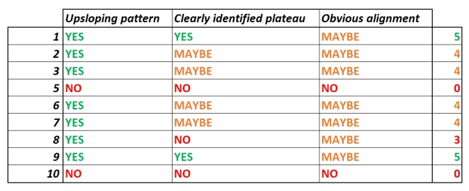

# Assessing autoregulation using cerebral oximetry in a prehospital setting

The purpose of this analysis is to find out if a pattern of the Lassen autoregulation curve can be found in measurement data recorded in a prehospital environment.

The two physiological signals used in this analysis are invasive blood pressure recorded using a ZOLL monitor-defibrillator, and left frontal lobe rSO2 recorded using a Nonin H500 NIRS monitoring device. Data collection was done as a part of the [BOPRA study](https://boprastudy.fi).

The source code can be found at <https://github.com/makes/bopra>.

1. [Waveform Identification](#step1)
2. [Data Aggregation](#step2)
3. [Data Cleansing](#step3)
4. [Automatic Time Synchronization](#step4)
5. [Manual Time Synchronization](#step5)
6. [COx Index Over Time](#step6)
7. [COx vs MAP](#step7)
8. [Scatterplot Smoothing](#step8)

## 1: Waveform Identification 

The ZOLL monitor-defibrillator stores the physiological signals recorded under six channel ids (0 to 5). The purpose of this step is to identify the nature of each signal to ensure correct processing.

Two visualizations were created for each channel. The first one shows the entire time span of the signal, and the second one shows a zoomed-in detail of ten seconds at the fifteen minute mark.

[View the images used for signal identification](analysis.php?page=1_images)

### ___Hypothesis:___

Each signal can be assumed to occupy the same channel id predictably across all cases. The invasive arterial pressure waveform required for the analysis can be found in all twelve cases.

### ___Interpretation:___

Signals identified for each case:

### ___Conclusion:___

Cases 4, 11, 12, 14, 23, 27, 28, 32, 33, 34, 35, 36, 37, 38, 39, 40, 48, 50, 52 and 57 did not contain the required IAP waveform, and thus will be excluded from further analysis.

Cases 22, 30, 31, 43, 44, 53 and 56 produce unresolved loading errors and will be excluded for the time being.

Of the 58 datasets provided, 31 have IAP data available under channel 1. Sample rate of the IAP pulse waveform is 125 Hz.

## 2: Data Aggregation 

In this step, mean arterial pressure is computed from the pulse waveform using a moving average of 10 seconds, then resampled to match the 1 Hz sample rate of the rSO2 signal.

A csv file containing both signals will be produced for each case, as well as a visualization of both signals on a common time axis.

The csv file will also contain columns indicating bad sample quality reported by the device, and a `Mark` field indicating start of anaesthesia.

### ___Hypothesis:___

Data from the two separate source devices can be converted to a common sample rate of 1 Hz and aggregated into a single csv file.

### ___Data:___

[View the visualizations](analysis.php?page=2_images)

### ___Conclusion:___

CSV files useful for further analysis were produced.

## 3: Data Cleansing 

In this step, anomalies and artefacts in MAP data will be identified by visual inspection of the signal. Any obviously invalid samples will be marked for exclusion.

Invalid values in rSO2 data have already been marked by the researchers based on field notes and visual inspection. These markings will be incorporated from a separate file. Corrected `Mark` timestamps indicating start of anaesthesia will also be included from this file. The corrections are based on field notes.

A csv file containing the data from step 2, amended with markings described above, will be generated.

### ___Hypothesis:___

There will be artefacts in the blood pressure signal caused by movement and nursing procedures.

### ___Interpretation:___

- Blood pressure data manually marked for exclusion is shaded red.
- Blood pressure data automatically marked as low quality is shaded darker red/grey
- rSO2 data manually marked for exclusion is shaded purple.
- rSO2 data automatically marked as low quality is shaded blue.

[View all visualizations](analysis.php?page=3_images)

### ___Conclusion:___

- Any abnormally high or abnormally low MAP readings were marked for exclusion.
- Periodically occurring drops in blood pressure were identified as a NIBP cuff restricting blood flow to the limb used for invasive blood pressure measurement. These values were marked for exclusion.
- The exclusion criteria are pending domain expert review.

A csv file containing the data described above was generated.

## 4: Automatic Time Synchronization 

It has been noted that the two monitoring devices used for data collection may have a clock discrepancy of several minutes. This is identified as a potential source of error, as the vasogenic phenomena under analysis cycle within 20 to 180 seconds ([_Steiner et al. 2008_](https://doi.org/10.1007/s12028-008-9140-5)).

### ___Hypothesis:___

Automatic synchronization using cross-correlation can be used to reliably align the signals.

__Caveat:__ _Lack of_ correlation between the signals indicates good autoregulation.

### ___Interpretation:___

Here is case 6 as an example of an auto-align attempt:

[View all visualizations](analysis.php?page=4_images)

Effect of alignment on the MAP-rSO2 pattern.

[View all visualizations](analysis.php?page=4_images)

### ___Conclusion:___

Cross correlation produced sensible results in only part of the cases. The method is not suitable for this analysis.

## 5: Manual Time Synchronization 

As the automatic cross-correlation method proved unreliable for aligning this type of data, time synchronization is done manually, by visual inspection.

### ___Hypothesis:___

Manual synchronization using visual inspection can be used to reliably align the signals.

### ___Interpretation:___

[View all visualizations](analysis.php?page=5_images)

Effect of alignment on the MAP-rSO2 pattern.

[View all visualizations](analysis.php?page=5_images)

### ___Conclusion:___

Manual alignment was used, based on visual inspection of common patterns between the signals. Part of the cases show no clearly identified point of alignment.

## 6. COx index over time 

[___TODO___]: For BOPRA objective _"To assess the association between time on cerebral blood flow autoregulation range (defined as COx < 0.3) and mortality, morbidity and quality of life."_

This will possibly require patching data discontinuities (imputation) using interpolation or some other method.

### ___Hypothesis:___

### ___Interpretation:___

[View all visualizations](analysis.php?page=6_images)

[View all visualizations](analysis.php?page=6_images)

### ___Conclusion:___

## 7. COx vs MAP 

[___TODO___]

## 8: Scatterplot smoothing 

[___TODO___]: Using a [local regression](https://en.wikipedia.org/wiki/Local_regression) method like the lowess smoother in [Seaborn](https://seaborn.pydata.org/tutorial/regression.html)?
